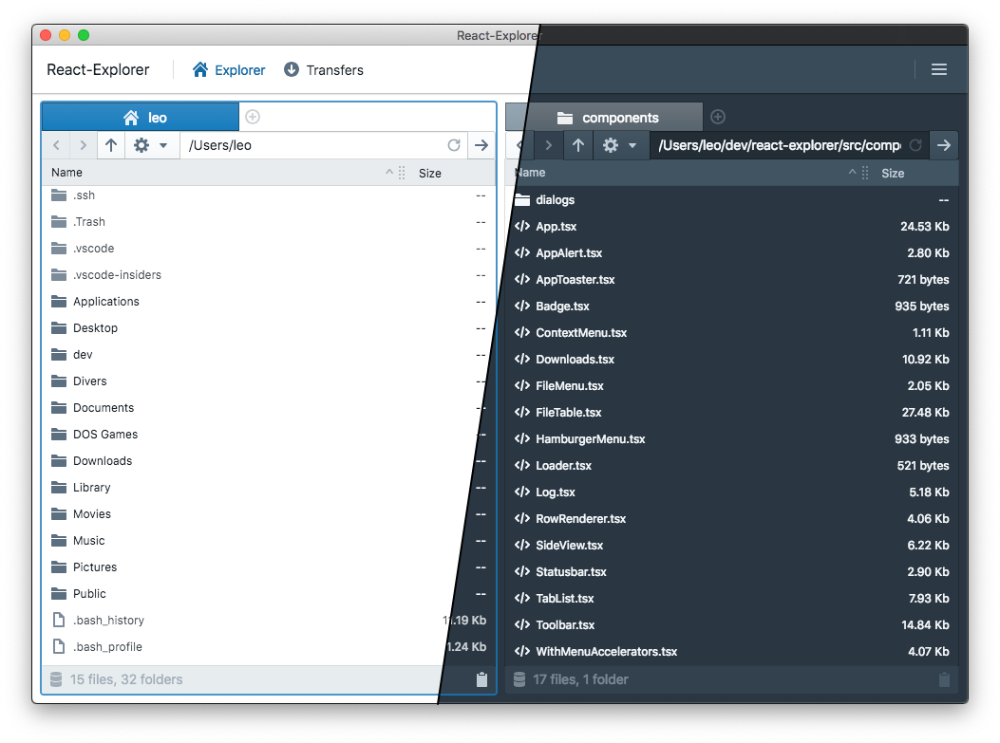
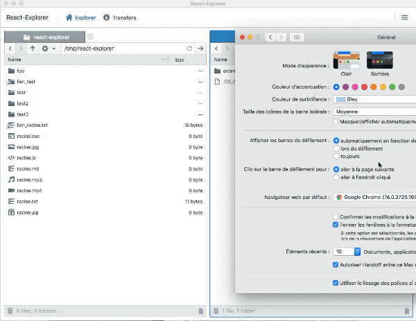
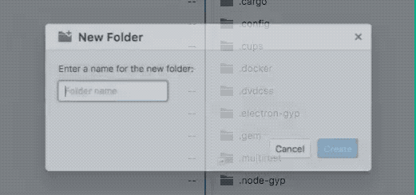
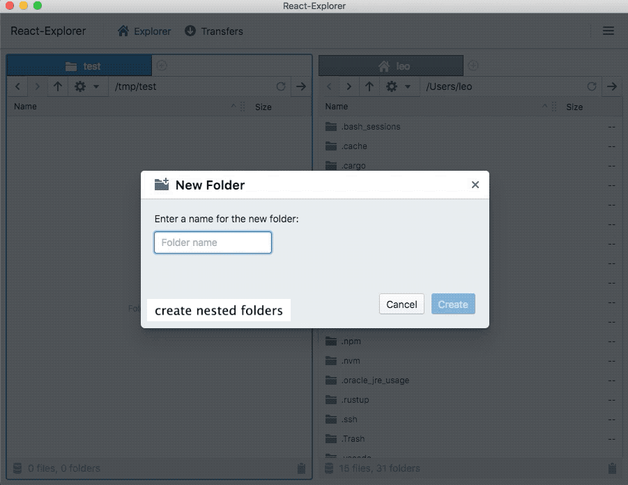
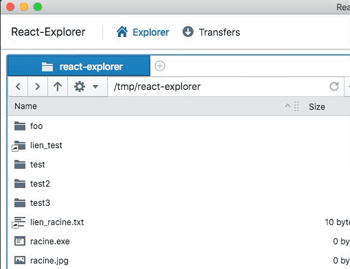

# File manager written in TypeScript & React



## Features

- Dual-view window
- Tabs support
- Fully keyboard controlled
- Fully localized (French & English available)
- Dark Mode with automatic detection (macOS Mojave)
- Open a terminal from any folder
- Plugin-based: local supported for now, ftp in the works

## Feature tour

### Dark theme automatic detection (macOS Mojave)

React-Explorer will automatically switch to dark-theme when it's detected:



### Create and read folder

By pressing `ctrl` (Linux/Win) or `cmd` the folder you create will be automatically read:



### Create nested folders

You can create several folders at once by separating them with a forward-slash:



### Quick access to parent folders

By right-clicking on a tab's icon you can quickly get access to the parents of the currend folder:



## Requirements

React-Explorer works on any modern Windows, Mac or Linux computer.

## Building for local development

In order to build React-Explorer you need to have installed `nodejs`.

Once installed, building React-Explorer is as easy as typing:

```shell
npm install && npm run build
```

This will build a development package.

In order to run in locally without having to create a native executable, you can then type:

```shell
npx electron ./build/main.js
```

## Building binary packages
In order to build binary packages, simply type the following:

```shell
npm run dist
```

This will build packaged binaries of React Explorer into the `dist` folder for every supported platform.

React-Explorer can also be built for a single patform. For example, to build only the Windows binaries, type:

```shell
npm run dist-win
```

## How to develop a new Plugin

React-Explorer has been written so that it can easily be extended using plugins.

As a starting point you may use the `FsGeneric` skeleton.

## Acknowledgments

React-Explorer makes use of the following tools/components:

 - [React](https://reactjs.org)
 - [Electron](https://electron.s.org)
 - [TypeScript](https://typescriptlang.org)
 - [MobX](https://mobx.js.org)
 - [Blueprintjs](https://blueprintjs.com)
 - [basic-ftp](https://github.com/patrickjuchli/basic-ftp)
 - [i18next](https://i18next.com) & [react-i18n](https://github.com/i18next/react-i18next)

 ## Licence

 React-Explorer is licenced under the MIT licence.
