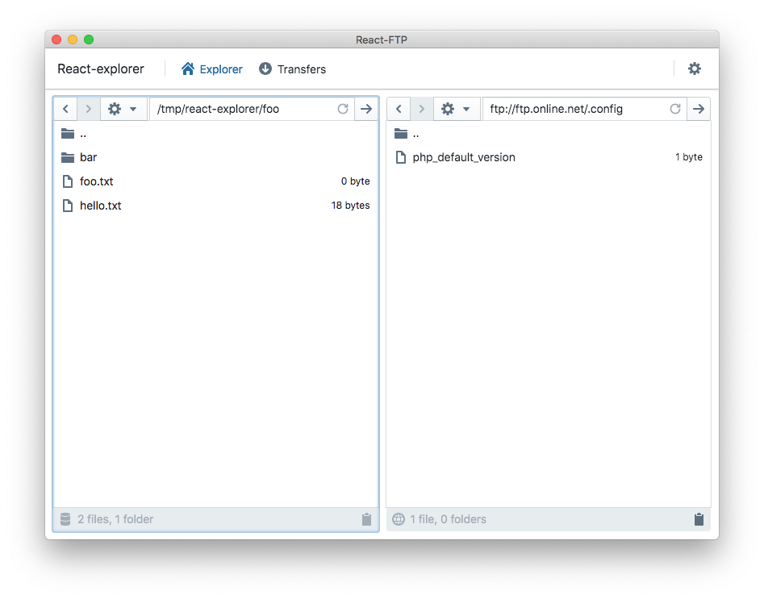

# FTP & local file explorer written in TypeScript & React



## Features

**Note**
React-Explorer is still being worked on so this is a work in progress.

- Plugin-based filesystem type: local supported for now
- Can be fully keyboard controlled
- Transfers from/to any plugin
- Fully localized (French & English available)
- Dark Mode with automatic detection on macOS Mojave

## Requirements

- Windows 7
- macOS
- Linux

## Building for local development

In order to build React-Explorer you need to have installed `nodejs`.

Once installed, building React-Explorer is as easy as typing:

```shell
npm install && npm run build
```

This will build a development package.

In order to run in locally without having to create a native executable, you can then type:

```shell
npx electron ./dist/main.js
```

## Building binary packages
In order to build binary packages, simply type the following:

```shell
npm run dist
```

This will build packaged binaries of React Explorer into the `dist` folder.

## Tests

## How to develop a new Plugin

React-Explorer has been written so that it can easily be extended using plugins.

TODO

## Acknowledgments

React-Explorer makes use of the following tools/components:

 - [React](https://reactjs.org)
 - [Electron](https://electron.s.org)
 - [TypeScript](https://typescriptlang.org)
 - [MobX](https://mobx.js.org)
 - [Blueprintjs](https://blueprintjs.com)
 - [basic-ftp](https://github.com/patrickjuchli/basic-ftp)
 - [i18next](https://i18next.com) & [react-i18n](https://github.com/i18next/react-i18next)

 ## Licence

 React-Explorer is licenced under the MIT licence.
